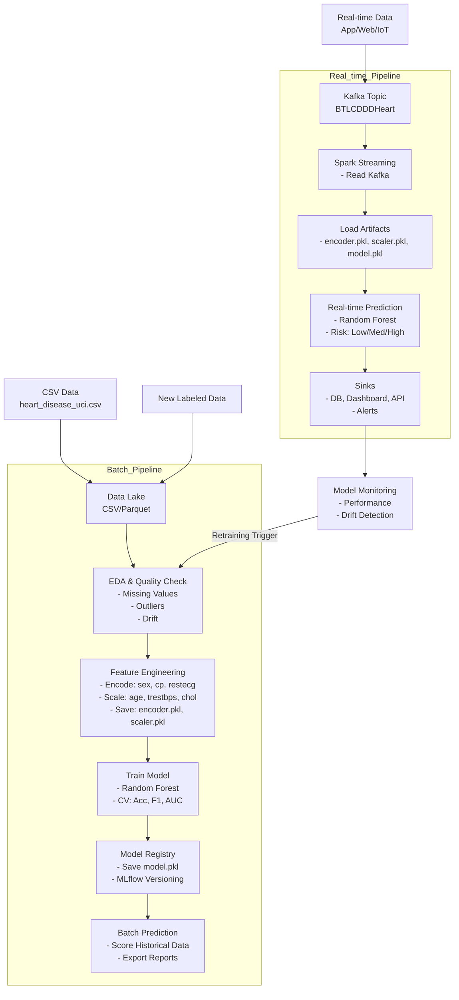

Bài tập lớn môn:
Phân tích và dự báo dữ liệu học sâu

- Sinh viên thực hiện:

  - Mai Xuân Duy
  - Nguyễn Duy Tân

- Các bước thực hiện

  - Build môi trường trên docker, mở terminal và chạy lệnh
    . docker-compose build
    . docker-compose up -d
  - Sau khi đã khởi tạo môi trường xong
    . Khởi tạo topic để truyền dữ liệu, mở terminal và chạy lệnh:
    docker exec -it kafka bash
    kafka-topics.sh --create --topic BTLCDDDHeart --bootstrap-server localhost:9092

    . Kiểm tra các topic đã tạo:
    docker exec -it kafka bash
    kafka-topics.sh --list --bootstrap-server localhost:9092

    . Kiểm tra kafka đã truyền nhận dữ liệu thành công chưa, mở 2 terminal và chạy các lệnh:
    terminal 1:
    docker exec -it kafka bash
    kafka-console-consumer.sh --topic BTLCDDDHeart --from-beginning --bootstrap-server localhost:9092
    terminal 2:
    docker exec -it kafka bash
    kafka-console-producer.sh --topic BTLCDDDHeart --bootstrap-server localhost:9092

    . Bật module giả lập truyền dữ liệu
    docker exec -it python-app bash
    python3 sendStream.py

    . Bật module nhận dữ liệu, thực hiện chuẩn đoán, re-train models AI
    docker exec -it python-app bash
    python3 revStream.py

